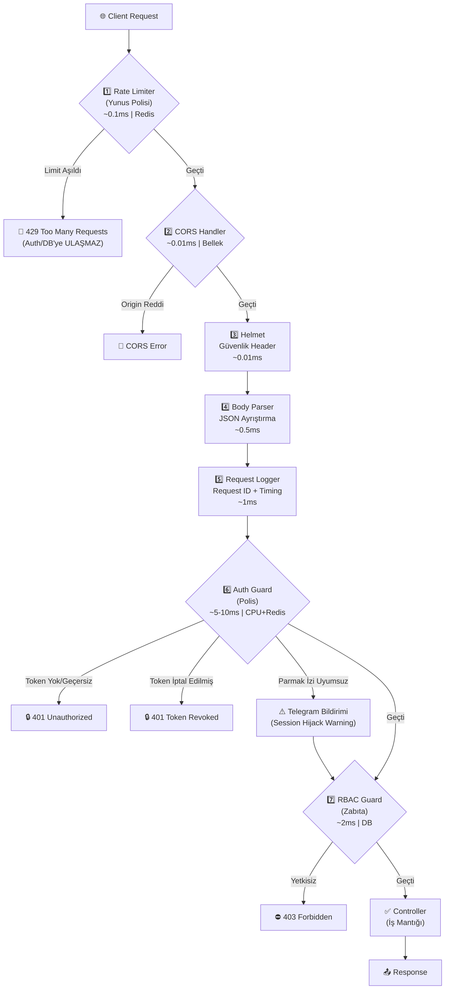
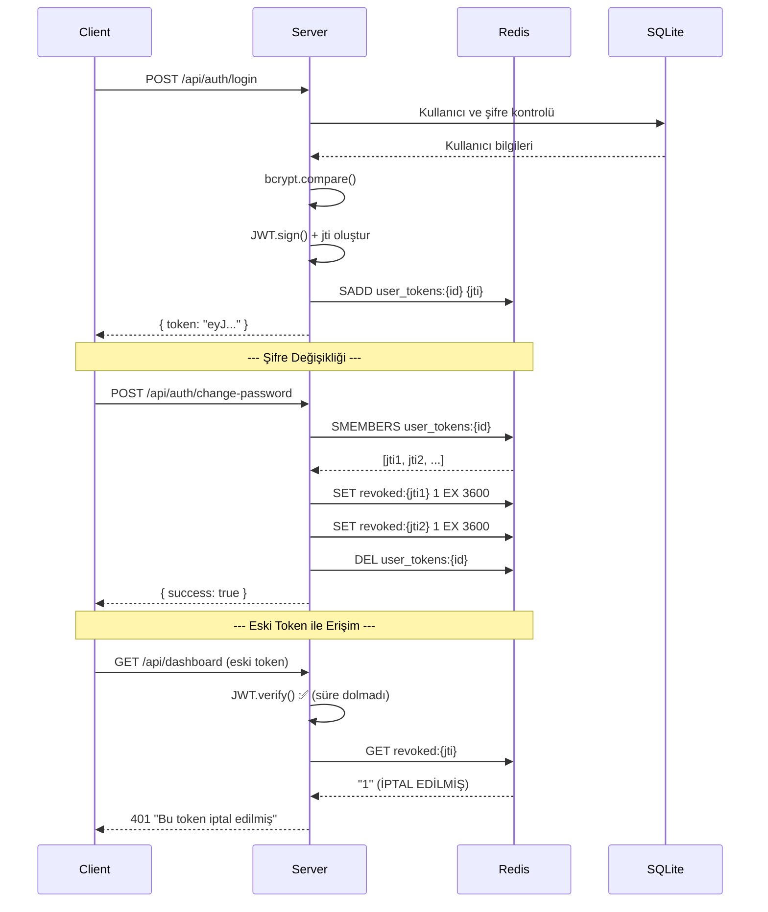
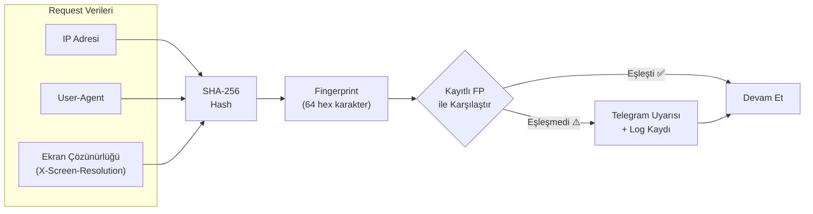

# Mimari Dökümantasyon — Middleware Selection

## Pipeline Akış Şeması



## Token Yaşam Döngüsü



## Parmak İzi (Fingerprint) Mekanizması



## Performans Karşılaştırması

### Doğru Sıra (Cheap Check First)

```
İstek #1-10:  Rate Limit OK → Auth → Controller  (toplam ~15ms)
İstek #11+:   Rate Limit 429 → DURDURULDU         (toplam ~0.1ms)
                                ↑
                          Auth/DB HİÇ çağrılmadı
```

### Yanlış Sıra (Auth Önde)

```
İstek #1-∞:   Auth (crypto.verify ~5ms) → Rate Limit → Controller
                     ↑
               HER istekte crypto çalışır
               DDoS'ta CPU tavan yapar!
```

## Veri Akışı

| Veri Tipi | Depolama | Erişim Süresi | Kullanım |
|-----------|----------|---------------|----------|
| Rate limit sayaçları | Redis | ~0.1ms | Hız sınırlama |
| İptal edilen token'lar | Redis (TTL) | ~0.1ms | Token blacklist |
| Aktif token set'leri | Redis (Set) | ~0.1ms | Toplu iptal |
| Kullanıcı bilgileri | SQLite | ~1-2ms | Auth, profil |
| Audit logları | SQLite | ~1-2ms | Güvenlik kaydı |
